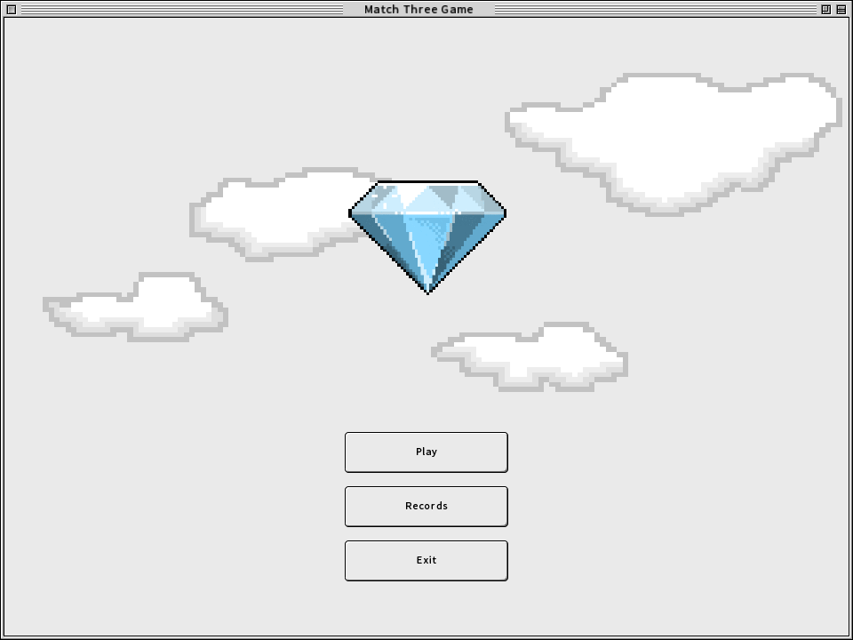
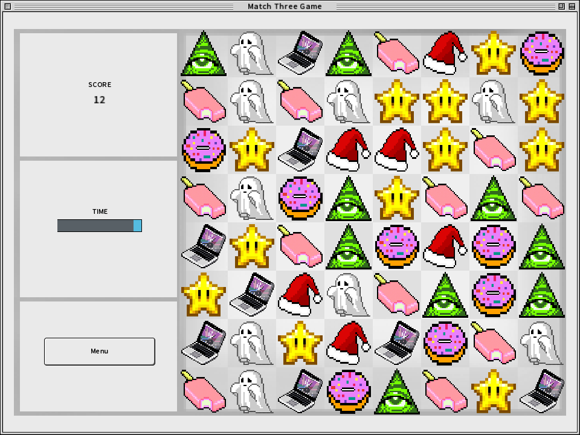

# Match Three game

I found interesting [skin](https://github.com/raeleus/OS-Eight-UI-Skin-Example) of Mac OS 8, got inspired and made this game. I created it using [LibGDX](https://libgdx.com/) framework and Scene2D for the UI.

## Screenshots

Main menu

Game screen

Records screen

